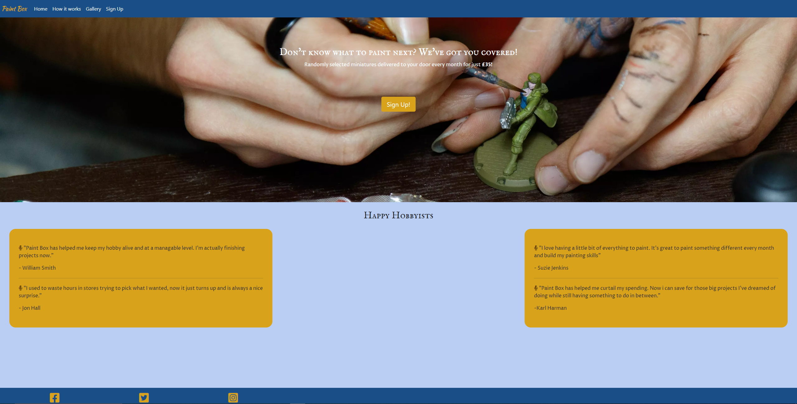
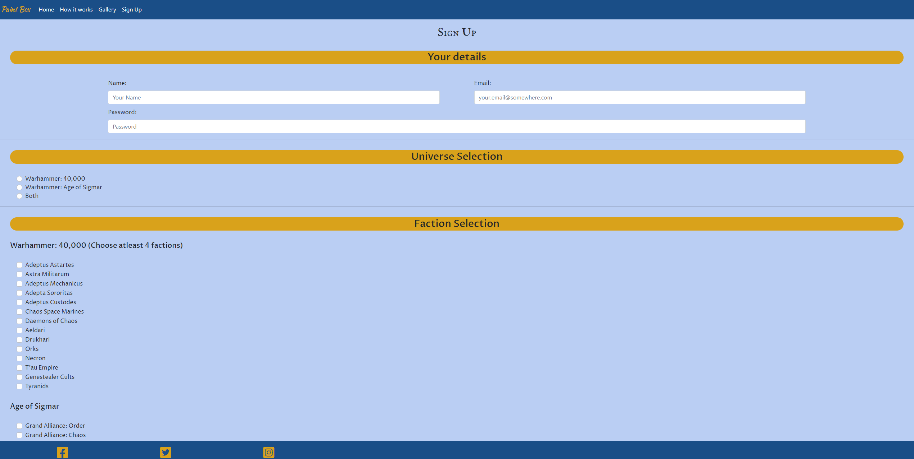

<h1 align="center">Paint Box Website</h1>

This is the main website for the Paint Box subscription service. It is designed to be responsive on a wide range of devices for maximum accessability for potential and existing customers.

As a semi-active hobbyist myself I decided on this service to make a website for because it is something that I would be interested in purchasing. Typically there are three different kinds of people that make up the community in terms of how they consume the product. We will be marketing towards two of these.
 

The painters - These guys are our primary target audience. They collect, paint and kitbash models to their hearts content. The variety of models that this subscription service provides would be very appealing and the spare parts can be added to the bits box for future projects.

The casual player - Although normally casual players tend to focus on one or two factions in order to have a functioning force to deploy on the battlefield, most do build and paint their own models. My service will give them the opportunity to branch out and develop their skills by painting different models to what they are used to. At the same time they can also opt to recieve the factions they already own to expand their collection.

The third is not our target audience and make up a small minority of consumers and either buy or trade models, even full armies, already painted to keep up with the ever shifting meta of the gaming side of the hobby.

## User Experince (UX)

### User Stories
 * ### First Time Visitor Goals
    * As a first time visitor i want to be able to easily identify the purpose of the site and the service the company provide.
    * I want to be able to easily navigate to more information and/or social links to judge how trustworthy the bussiness is
    * I would like to be able to see feedback from previous customers to see if the service is relevant to my needs and if those needs have been met by others before me.

* ### Returning Visitor Goals
    * Returning to the site I would like to be able to find more information on the product I have purchased/planning to purchase.
    * I would like to be able to find contact information for the company to provide feedback or report any issues/concerns I may have.

    
* ### Frequent Visitor Goals
    * Frequent visitation shouldn't be an issue. Once subscribed the customer should not have to revisit frequently to enjoy their product. Although I do have some ideas regarding this that can be found later in this file.
    * The goal of a frequent visitor would ideally be for word of mouth promotion, showing freinds and family how easy it is to get started.

## Design

### Colour Scheme

* Used ColorSpace to generate a classy palette around a deep blue I wanted to use as a filter for the hero image. Think uses greys and pinks to make the rest of the site pop.

### Typography

* I have chosen Cormorant SC and Proza Libre for the font families because the gothic feel of Cormorant fits the dystopian nature of the sci-fi and fantasy universes featured in the products rich lore and Proza compliments this nicely for the body text.

### Imagery

*  My hero image will be there to engage the customer and show the miniature hobby entails. There will also be a gallery of previous customers' minis from beginner and veteran painters.

* Gallery images were kindly given permission to be used by members of a Facebook group I belong to called 40k for Grown Ups. I explained what they would be used for and those people willing to help added their images to the post.

### Wireframes
* Link Tree

* Landing Page

* How it Works

* Gallery

* Sign Up

## Code

### Libraries

* Bootstrap 5.1.3
* Popper 2.10.2
* Google Fonts
* Font Awesome

### Tutorials

* I needed help changing the boostrap navbar colour which I found on [Geeks for Geeks](https://www.geeksforgeeks.org/how-to-change-navigation-bar-color-in-bootstrap/). This influenced my css to style the page in the way I wanted and not be limited to bootstraps default colours.

## Testing

* Typography - Cormorant proved to be a little too much and have switched to IM Fell English SC instead and Kaushan Script for the company name.

* Had unwanted white bars throughout styling which turned out to be padding on the container-fluid class preset and has since been removed in css.

* Colour pallette wasn't popping as much as I would like in practice. I have kept the blue but have gone with a golden yellow to help important things stand out. The grey wasn't contrasting enough with the hero image so have gone to white to ensure text can be read.

* Nav bar collaspe isn't functioning correctly. The menu will not retract when the button is clicked a second time. However clicking home again resets the button and typically users will navigate away from the home page when using the menu.

* I have been testing frquently in port 8000 and using Google's developer tools to gauage responsiveness over mobile, tablet and desktop sizes.

* Links were tested after deployment. One was linked to the wrong html file. That has been ammended and now links to the correct file.

* All code has been validated in the respective W3C validators.

## Known Bugs

* The main bug I have identified is the menu icon not retracting when clicked again to close.

## Deployment

### Deploying the Website

1. Start by logging in to GitHub and finding [my repository](https://github.com/Charlie-Walsh/milestone-1).
2. Under **Environments** on the right hand side click **github-pages**.
3. Next to the top item on the deployment history list click the **View Deployment** button. This will open the page in a seperate tab for you to view.

### Forking the Repository

By forking the repository you will create a copy to your own Github account. Here you will be able to view or edit code without changing the original repository.

1. Start by logging in to GitHub and finding [my repository](https://github.com/Charlie-Walsh/milestone-1).
2. In the top right hand corner of the window you will find the fork button.
3. You should now have your own copy of the repository.

### Cloning the Repository

You can also clone the repository to use locally.

1. Start by logging in to GitHub and finding [my repository](https://github.com/Charlie-Walsh/milestone-1).
2. To the left of the green Gitpod button is the Code dropdown button.
3. To clone using HTTPS copy the link under HTTPS.
4. Open Git Bash.
5. Make sure you change the working directory to the location you want the cloned directory to go.
6. Type "git clone" and paste the url you copied after it.
7. Press enter and your clone will be created.

## Future Development

In order to imporove the revistability of the site, as the company grows it would be good to have an area for the community to grow and share their work and ideas. A few ideas I have for expansion are as follows:

* Forum - A place where subcribers can communicate and share their experience. Newcomers could ask veterans for advice on certain painting techniques, post guides on how to achieve a certain effect or share what bits they have used for a model conversion.

* Painting Tutorials - Maybe using a higher tier for membership would give you access to in house painting tutorials and guides in video format. Although similar things can be found on youtube so the quality would have to be very high in order to warrant an extra cost. This could be included with a regular membership as an extra marketing device.

* FAQs - A place where general questions are answered by the company covering basic painting techniques, equipment and more detailed explanations of the service.

